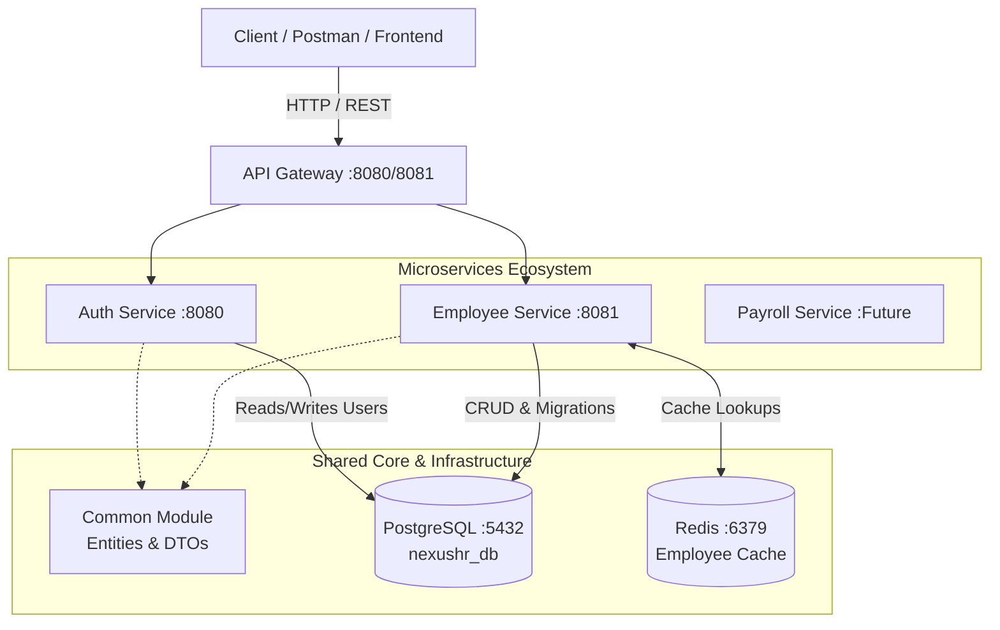

# 🚀 NexusHR Backend

<div align="center">


An enterprise-grade, scalable, and modular **Human Resources Management System (HRMS)** backend built with **Java 21**, **Spring Boot 3**, and modern **Microservices Architecture**.

</div>

---

## 📖 Overview

**NexusHR** is engineered to streamline modern workforce management through decoupled, high-performance services. By separating authentication, employee administration, attendance tracking, and leave management into independent domains, NexusHR guarantees high fault tolerance, easy horizontal scaling, and secure data access.

### ✨ Key Technical Highlights
- **Microservices & Multi-Module Architecture:** Built using Apache Maven multi-module structure, cleanly encapsulating domain entities in a shared `common` module while maintaining clear boundaries between independent services.
- **Automated Schema Evolution:** Powered by **Flyway**, ensuring deterministic, version-controlled database migrations (`V1` through `V4`) across environments without manual DDL intervention.
- **High-Performance Caching:** Integrated **Redis** caching tier for high-throughput, low-latency retrieval of frequently accessed data (such as employee directories).
- **Stateless & Granular Security:** Implements Spring Security with JSON Web Tokens (JWT) and robust password hashing. Endpoints are guarded using Role-Based Access Control (RBAC) via `@PreAuthorize` authorities (`ROLE_ADMIN`, `ROLE_HR`, `ROLE_MANAGER`, `ROLE_EMPLOYEE`).

---

## 🏗️ System Architecture



---

## 🧩 Modules & Microservices Breakdown

| Module / Service | Port | Status | Description |
| :--- | :---: | :---: | :--- |
| **`common`** | — | Active | Shared library containing core JPA Entities (`Employee`, `UserAuth`, `Attendance`, `LeaveRequest`), Enums, and Repositories. |
| **`auth-service`** | `8080` | Active | Handles user onboarding (`/signup`), authentication (`/login`), token creation, and credentials validation. |
| **`employee-service`** | `8081` | Active | Core business engine managing employee profiles, attendance logs, leave workflows, and role promotions. |
| **`api-gateway`** | — | Scaffolded | Single entry point and routing gateway for unified traffic management across microservices. |
| **`payroll-service`** | — | Planned | Dedicated service planned for automated salary computation, tax deduction, and payslip generation. |

---

## 🗄️ Database & Schema Migrations (Flyway)

NexusHR utilizes **Flyway** inside the `employee-service` to manage database schema migrations seamlessly upon application startup (`validate` / `baseline-on-migrate`).

* **`V1__init_schema.sql`**: Initializes core employee profile tables and organizational metadata.
* **`V2__add_attendance_table.sql`**: Creates daily attendance logs linking employee check-in and check-out timestamps.
* **`V3__add_leave_request_table.sql`**: Introduces leave request tracking with status lifecycles (`PENDING`, `APPROVED`, `REJECTED`).
* **`V4__add_users_table.sql`**: Establishes secure user credentials, roles, and authorization mappings.

---

## 🛠️ Prerequisites & Local Setup

### 1. System Requirements
* **Java Development Kit (JDK):** Version 21 or higher
* **Apache Maven:** Version 3.8+
* **PostgreSQL:** Server running on port `5432`
* **Redis Server:** Running locally on port `6379`

### 2. Database Configuration
Create the target database inside your PostgreSQL server:
```sql
CREATE DATABASE nexushr_db;
```
*Note: Ensure database credentials match `application.yml` (`username: postgres`, `password: admin123`).*

### 3. Build the Multi-Module Project
From the project root directory (`nexushr-backend`), compile and package all modules:
```bash
mvn clean install
```

### 4. Running the Microservices
Start the required services in two separate terminal windows:

**Terminal 1 — Start Auth Service:**
```bash
cd auth-service
mvn spring-boot:run
# Runs on http://localhost:8080
```

**Terminal 2 — Start Employee Service:**
```bash
cd employee-service
mvn spring-boot:run
# Runs on http://localhost:8081
```

---

## 🔌 API Reference Summary

For detailed request payloads, cURL commands, and step-by-step test execution, refer to [TESTING_APIS.md](TESTING_APIS.md).

### 🔐 Auth Service (`:8080`)
| Method | Endpoint | Description | Auth Required |
| :---: | :--- | :--- | :---: |
| `POST` | `/api/auth/signup` | Register a new employee & user credentials | Public |
| `POST` | `/api/auth/login` | Authenticate user and return JWT Bearer token | Public |

### 👥 Employee Management (`:8081`)
| Method | Endpoint | Description | Required Role / Authority |
| :---: | :--- | :--- | :--- |
| `GET` | `/api/employees` | Fetch all employees (cached via Redis) | `ADMIN`, `HR`, `MANAGER` |
| `GET` | `/api/employees/{id}` | Fetch specific employee details | `VIEW_EMPLOYEE` / Owner |
| `POST` | `/api/employees` | Onboard employee & generate login account | `CREATE_EMPLOYEE` |
| `PUT` | `/api/employees/{id}` | Update employee profile information | `UPDATE_EMPLOYEE` |
| `PUT` | `/api/employees/{id}/role` | Promote / Reassign user role | `ADMIN`, `HR` |
| `DELETE` | `/api/employees/{id}` | Remove employee profile | `DELETE_EMPLOYEE` / `ADMIN` |

### 🕒 Attendance Management (`:8081`)
| Method | Endpoint | Description | Required Role / Authority |
| :---: | :--- | :--- | :--- |
| `POST` | `/api/attendance/clock-in` | Record daily clock-in timestamp | Authenticated Employee |
| `POST` | `/api/attendance/clock-out` | Record daily clock-out timestamp | Authenticated Employee |
| `GET` | `/api/attendance/{empId}` | View attendance history logs | Authenticated Employee / HR |

### 🏖️ Leave Management (`:8081`)
| Method | Endpoint | Description | Required Role / Authority |
| :---: | :--- | :--- | :--- |
| `POST` | `/api/leaves/request` | Submit a leave request (`VACATION`, `SICK`, etc.) | `APPLY_LEAVE` |
| `GET` | `/api/leaves/pending` | List all pending leave requests | `HR`, `ADMIN` |
| `PUT` | `/api/leaves/{id}/status` | Approve or reject a leave request | `APPROVE_LEAVE` (`HR`/`ADMIN`) |

---

## 🧪 E2E Verification Flow

1. **Onboard & Authenticate:** Register via `POST http://localhost:8080/api/auth/signup` or login via `POST http://localhost:8080/api/auth/login` to obtain your Bearer JWT token.
2. **Authorize Requests:** Add header `Authorization: Bearer <JWT_TOKEN>` to all API calls on port `8081`.
3. **Manage Profiles:** Create or retrieve employees via `/api/employees`. First fetch will hit PostgreSQL; subsequent calls will retrieve directly from Redis cache.
4. **Track Operations:** Clock in/out via `/api/attendance/*` and submit leave requests for HR workflow validation via `/api/leaves/*`.

---

## 🚀 Future Roadmap
- [ ] **API Gateway Integration:** Complete dynamic routing, load balancing, and rate-limiting rules.
- [ ] **Payroll Microservice:** Automated tax calculation, payroll generation, and payslip export (PDF).
- [ ] **Containerization:** Complete Dockerfiles and `docker-compose.yml` for instant orchestration of Postgres, Redis, and Spring Boot services.
- [ ] **Event-Driven Messaging:** Introduce Apache Kafka / RabbitMQ for asynchronous notifications (e.g., email alerts on leave approval).
